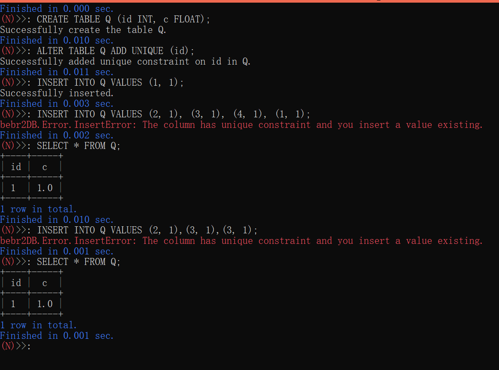

# 项目总结报告-58组-BeBr2

**bebr2DB**数据库主要使用**python**语言编写，GUI前端部分使用**html + js**语言编写。总代码量约为4500行（不包括antlr4生成的代码，不包括自己设计的测试代码，但包括空行和注释）。代码及运行方法详见代码提交窗口。

## 系统架构设计

系统架构和助教提供的有差异。架构图如下：


用户和本数据库系统的一次交互过程如下：

如果使用CLI版本，获得用户命令后直接提供给解析器；如果使用GUI版本，python的eel库启动了一个本地的web服务器，所以实际上相当于前后端分离，前端获得用户输入命令，通过eel库建立的通道将命令提供给解析器，这个进程同步地等待数据库系统的返回数据，前端处于阻塞状态（但用户可以进行与后端无关的其他前端操作）。

命令解析器得到用户输入后进行语法分析，在语法正确的条件下，根据分析结果调用系统管理模块的对应函数，以及向系统管理模块传入数据。

系统管理模块根据传入的命令调用下层的模块。本系统将数据库的**文件类型**分为**索引文件**和**记录文件**，分别由索引模块和记录管理模块访问或删改。如果需要索引的增删改或查询操作，调用索引模块；如果需要记录的增删改或查询操作，调用记录管理模块。值得一提的是，每个数据库都有名为`attrcat`的文件记录数据库下各表及其信息，这个文件是记录文件类型。

同时，系统管理模块也有直接和文件系统交互的时候，仅限于从文件系统中获得一个文件夹的文件名，以展示所有数据库名称或某数据库下的表名。

索引模块和记录管理模块通过页式文件系统读写、增删文件。

页式文件系统主要负责管理缓存，即缓存的分配、替换、写回文件系统等操作。

最后得到的数据或其他结果会逐层返回，通过CLI或GUI展示给用户。

## 各模块详细设计及主要接口说明

本部分将分模块介绍设计思路，同时说明该模块下的主要接口，为了说明方便，设计思路也会部分掺在接口说明中展现。

这部分代码在项目根目录的`bebr2DB`文件夹下，每一个模块对应一个子文件夹。如果没有特别说明，文件头和页头部分的数字类型都解析为4字节的uint32，以大端储存。而记录、索引等的数据类型中的INT和FLOAT都以小端储存。

### 页式文件系统

参考助教提供的C++代码实现。以8KB为页面大小，60为缓存页数。

用模的哈希算法进行文件号和页号到缓存页下标(即0-59)的映射。用令牌环储存缓存页的文件号和页号。

每一个缓存页，对应一个数据类型为numpy.uint8的一维numpy.ndarray，使用numpy数组的原因是比python list更节省内存，储存更紧凑。

#### 主要接口

该部分对应代码中的`FileSystem`文件夹，其他模块调用该模块的`BufPageManager`类。以下方法均为该类的方法：

`__getPage(self, fileID, pageID)`函数：对于输入的文件号和页号，如果页面不在缓存中，通过替换算法分配一个缓存页面，并通过os读取文件并存在该缓存页面中。返回一个缓存页（的numpy数组）及其缓存页下标。

`readPage(self, fileID, pageID)`函数：调用`__getPage`方法读取一个缓存页（的numpy数组），返回其拷贝。这个函数的调用者无法修改缓存页的内容。

`getPage(self, fileID, pageID)`函数：调用`__getPage`方法读取一个缓存页（的numpy数组）并返回。这个函数的调用者可以修改缓存页的内容，因此这个函数会把该缓存页标记为脏页。

`newPage(self, fileID, data)`：纯IO操作，直接把传入的data（numpy.uint8的numpy.ndarray）写到文件的末尾，并返回页号，要求data的大小就是缓存页面的大小。

`writeBack(self, index)`：写回下标为index的缓存页面（如果是脏页的话），并修改替换算法、哈希表的内容。

### 记录管理模块

使用定长记录的方法。以下说明中，槽指的是记录页中除页头外，剩下的放记录数据的位置，一条数据对应一个槽，槽的大小是记录的大小，一个页面中槽的数量由记录大小决定。

记录管理模块的文件头、页头定义如下：

文件头：位于文件的首页，第一个有空槽的页号、记录总数、文件总页数、页头大小、记录大小。。

页头：两项内容。前4字节表示该页面的下一个有空槽的页号，如果自指，说明该文件没有空闲页。第二项为一个bitmap，第n位对应第n个槽是否为空，空槽对应0。bitmap的长度是槽的数量除以8再向上取整的字节数。

记录管理通过页式文件系统来操作记录文件，解析出文件的信息，以及向上层提供记录的增删改及查询扫描等功能，注意这里不负责解析出记录的内容，上层只需要提供记录的大小就可以储存任何（大小合适的）记录。

#### 主要接口

该部分对应代码中的`RecordManager`文件夹。`Rid`类指明了一条记录的位置（页号和槽号结合可以唯一确定，以下简称**Rid**），`RM_Record`类储存了一条记录的数据（numpy.uint8的numpy.ndarray类型）和其Rid，`RM_FileHdr`负责解析并储存记录文件的文件头信息。以下几个类提供了对外接口：

**RM_FileHandle**：针对单个文件的操作，提供了`getRecord(self, rid: Rid)`（通过Rid获得记录数据，返回一个RM_Record），`deleteRecord(self, rid: Rid)`（删除Rid位置的数据），`insertRecord(self, data: np.ndarray)`（插入一条数据），`updateRecord(self, record: RM_Record)`（更新传入的record的Rid位置的数据）等接口，在这些操作后，会根据页面是否已满或从满到未满或新增页面等信息修改文件头。

**RM_Manager**：调用页式文件系统，提供`createFile(self, filename, record_size)`，`openFile(self, file_name)`，`closeFile(self, file_handle: RM_FileHandle)`，`removeFile(self, filename)`等增删打开关闭记录文件的接口。且负责更改文件中的文件头。

**RM_Scan**：提供记录文件逐条记录级别的扫描。

`openScan(self, file_handle:RM_FileHandle, attrType: int, attrLength: int, attrOffset, comp_func, value=None)`：通过提供属性类型、属性长度、属性偏移，能够从`RM_Record`的数据中解析某个属性的值，传入comp_func和value以进行扫描时的比较。对应的还有`closeScan`关闭这次扫描。

`getNextRecord(self, rid: Rid)`：通过传入的Rid，找到该记录文件中此Rid的下一条符合扫描要求的记录数据。

### 索引模块

通过B+树实现索引功能，一个页面对应B+树的一个节点，为上层提供B+树的插入删除，以及查询扫描接口。

索引模块的文件头、页头定义如下：

文件头：根节点的页号、索引的属性类型、属性长度、树高、页数。

页头：下一个叶节点或溢出页节点（若全1，则是最后一个叶节点，若为0，则为内部节点）、上一个叶节点或溢出页节点（若全1，则是第一个叶节点，若为0，则为内部节点）、节点填充度，父节点的页号。

在B+树的数据中，重复值使用溢出页来储存，一个值对应一个溢出页（的列表）；NULL值则不使用索引文件，而是使用记录文件来存储，存储的数据是NULL值对应的Rid。

在索引插入或删除时，除B+树的分裂合并外，还需要判断溢出页，如果删除使得某个值只有一个溢出页且只有一个Rid，会把溢出页删除并把该Rid存回叶节点对应的地方；如果插入使得某个value对应的Rid有多个，则会新增溢出页。溢出页如果满了，需要新增一页。

#### 主要接口

该部分对应代码中的`Index`文件夹。

节点定义在`Node.py`中，类型分为内部节点、叶节点、溢出节点（视为非内部节点），都继承自一个基类，基类储存的数据对应页头储存的数据，内部节点和叶节点都有对应的key和value，对于m阶B+树，key都是(m-1)的长度，而内部节点的value是m的长度。

内部节点的key是子节点最大关键字的有序排列，value是子节点的页号序列；叶节点的key是关键字的有序排列，value是对应的Rid序列，叶节点的Rid的页号若是-2，说明该值有溢出节点，Rid的槽号对应溢出节点的页号。而溢出节点则储存着该值下的所有Rid。

**IX_FileHandle**：针对单个文件的操作，提供了`searchEntry(self, raw_data)`（对于传入的值，在B+树中查询，返回(是否找到，若找到的叶子节点，位置)），`deleteEntry(self, raw_data, rid: Rid)`（B+树的删除操作），`insertEntry(self, raw_data, rid: Rid)`（B+树的插入操作）。

**IX_Manager**：调用页式文件系统，提供`createIndex(self, filename, index_no, attr_type, attr_length) `，`openIndex(self, filename, index_no)`，`closeIndex(self, file_handle: IX_FileHandle)`，`removeIndex(self, filename, index_no)`等增删打开关闭索引文件的接口。且负责更改文件中的文件头。索引文件的设计为：表明 + '.' + 索引的唯一id号。 

**IX_Scan**：提供索引文件的B+树加速扫描。

`openScan(self, file_handle:IX_FileHandle, compOP: int, value = None)`：在B+树下，compOP支持 = 、>、<、>=、<=的比较，以及全表的扫描。对应的还有`closeScan`关闭这次扫描。

`getNextEntry(self)`：得到下一个符合扫描要求的Rid及对应的索引值。

### 系统管理模块

作为最核心的模块，负责实现各种数据库的查询解析和系统管理的操作。上文已经提到，每个数据库都有名为`attrcat`的文件记录数据库下各表及其信息，这个文件是记录文件类型。各表的信息解析如下：

表名、属性名、属性在`RM_Record`中的偏移、属性类型（用int的1、2、3分别表示INT、FLOAT、STRING，对应属性长度是4、4、1~256）、属性长度、索引唯一id号（如果为0则为主键）、是否允许NULL、default值、default值是否为NULL、是否有UNIQUE约束、是否有外键、外键的表名、外键的名字、属性的rank（即第几个属性）。

以上的信息通过记录管理模块在`attrcat`文件中实现增删。

系统管理模块通过操作记录管理模块来操作表，一个表是一个记录文件，其记录是一个标记是否NULL的bitmap与各属性值的拼接，这个bitmap的长度是属性数量除以8的向上取整的字节数。

系统管理模块通过操作索引模块来操作索引，但是对于NULL值，新增一个名为表名+'.'+索引唯一id号+'null'的记录文件来存储对于的Rid。

#### 主要接口

该部分代码在`SystemManager`文件夹下，主要是`SM_MANAGER`类，这个类接口很多也都很重要（因为基本上，一个接口对应一个或多个SQL语句的操作），所以不一一列举，这里列出这个模块的一些实现，包括但不限于以下内容：

- 对传入的表名.属性名、属性名、表名、数据库名的存在性作判断。
- 对传入的属性值的类型作判断，以及与`attrcat`中真正的类型比较。注意这里对于传入属性值判断为INT的数据，可以插入类型为FLOAT的列（例如1，会视为1.0而不报错）。
- 对完整性约束、NULL相关的约束、UNIQUE相关的约束作判断。
- 处理Where_Clause时，对于单表，如果有这种情况："column op value"语句且对于列有索引，先用索引扫描得到一个Rid的列表，再在Rid列表中逐个判断是否符合剩下的要求。对于双表，先对除"column op column"外的语句，分成两个单表的内容，得到各自符合要求的Rid列表，再对这两个列表进行笛卡尔积，剔除掉不符合剩下"column op column"的Rid。
- INSERT、DELETE、UPDATE时的**事务性功能**，即第一次遇到冲突写入时报错并终止语句，前面已有的写入失败。以INSERT为例子，实现过程如下：对要插入的数据，先全部判断类型是否正确，再判断是否满足各种约束（NOT NULL、UNIQUE、主外键约束等），在判断唯一性时，先对插入的数据内部判断是否有重复，再与表中现有的数据比较来判断。只要上面的判断有不符合要求的，就报错返回，只有全部插入符合要求才开始插入。
- LIKE语句中%与_不是简单地转化为python的正则表达式'.*'和'.'，而是判断用户是否有转义，即LIKE语句的'\%'会转化为正则表达式的'%'；如果LIKE语句中有'.'和'\*'等python正则表达式的特殊符号，转化时需要转义。
- 分页查询时，如果是单表查询，则查询到OFFSET+LIMIT就返回；双表则是对最后的结果切片返回。

### 命令解析器

在`Compiler`文件夹下，使用antlr4以及助教提供的`SQL.g4`文法生成python代码，使用访问者模式来访问AST节点。

另外，还有一个模块`SQLOutput`用来处理系统管理模块的输出，对于CLI模式，使用prettytable库来美化表格，对于GUI模式，则是把输出处理为符合前端使用的数据。

另外，命令解析器还负责统计系统管理查询解析的时间，反馈给UI。


以下部分代码在项目根目录下：

### UI

#### CLI

使用click库来进行命令行交互，使用colorama库来给cmd下的命令行输出加颜色，使得呈现结果醒目美观。每一个操作后都会输出完成时间。代码在`cli.py`中。

#### GUI

使用eel库，可以建立一个本地Web服务器，把python函数和js函数互相暴露给对方调用，实现了前后端通信。同时使用eel库的优点是，可以用js和html设计前端，大大简化了美化前端的工作。前端表格的展示使用了分页功能，用户可以方便地切页查看。后端代码在`web.py`中。

因为前端GUI内部和前后端通信的是分离的，因此在查询较久时，用户除了无法继续向后端提交SQL语句外，仍然可以在前端浏览查询此前获得的内容，尤其是继续浏览此前得到的表格。前端代码在`./bebr2DB/Web`文件下，js和html代码都集成在这个main.html文件中。

## 实验结果

代码框架：

```
+---bebr2DB
|   +---Compiler
|   +---Data
|   +---DataBase
|   +---Error
|   +---FileSystem
|   +---Index
|   +---RecordManager
|   +---SystemManager
|   +---Web
|---mytest
|---cli.py
|---web.py
```

### CLI展示

验收时未充分展示的是INSERT、DELETE、UPDATE时的事务性功能。展示如下：



验收时未展示的LIKE语句中%与_的转义，展示如下：


### GUI展示


分页及跳转功能：


## 小组分工

本组只有BeBr2一人，完成了必做功能，以及选做中的模糊查询、聚合查询、分组查询、分页查询、UNIQUE约束、NULL功能、GUI功能，以及实现了INSERT、DELETE、UPDATE时的事务性。

## 参考文献

主要参考助教文档、MySQL教程网站[MySQL约束、函数和运算符 (biancheng.net)](http://c.biancheng.net/mysql/60/)。

记录管理模块、索引管理模块的接口设计参考了斯坦福CS346课程RedBase项目的项目介绍[RedBase Project - CS346 Spring 2015 (stanford.edu)](https://web.stanford.edu/class/cs346/2015/redbase.html)。页式文件系统的实现是参考助教提供的C++代码进行python化的，命令解析使用的文法文件`SQL.g4`是助教提供的。

选用python语言是因为阅读了饶淙元助教2021年课程的数据库大作业的实验报告，里面提到了python语言写数据库大作业的可行性，同时也是因为自己认为python语言在前端设计可以节省很多时间（例如prettytable库、eel库，且更好作为js/html的后端）。

